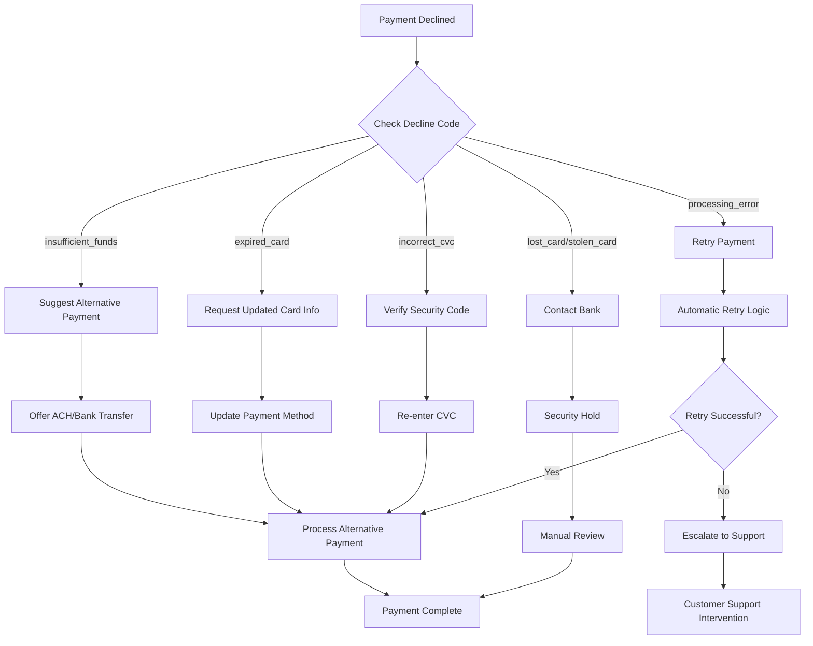

# Help Content & Support Documentation

## Overview

This help content section provides comprehensive troubleshooting guides, developer support resources, and platform support documentation to help you resolve issues quickly and efficiently.

---

## Support Categories

### Troubleshooting Guides
- **[Payment Processing Issues](./troubleshooting/payment-issues.md)** - Common payment problems and solutions
- **[API Integration Problems](./troubleshooting/api-issues.md)** - Development and integration troubleshooting
- **[Authentication Errors](./troubleshooting/auth-errors.md)** - API key and security issues
- **[Webhook Problems](./troubleshooting/webhook-issues.md)** - Event delivery and processing issues

### Developer Support
- **[Error Code Reference](./developer-support/error-codes.md)** - Comprehensive error code documentation
- **[Debugging Tools](./developer-support/debugging-tools.md)** - Development and testing utilities
- **[Performance Optimization](./developer-support/performance.md)** - Speed and efficiency improvements
- **[Migration Guides](./developer-support/migration.md)** - Upgrading and version changes

### Platform Support
- **[Account Management](./platform-support/account-management.md)** - Dashboard and settings issues
- **[Billing & Pricing](./platform-support/billing.md)** - Pricing questions and billing support
- **[Compliance & Security](./platform-support/compliance.md)** - Regulatory and security guidance
- **[Service Status](./platform-support/service-status.md)** - System health and maintenance

---

## Quick Problem Resolution

### Most Common Issues

#### 1. Payment Declined (Error Code: payment_declined)
**Symptoms:**
- Customer payment fails at checkout
- Error message: "Your payment was declined"
- Transaction shows as failed in dashboard

**Immediate Solutions:**
```javascript
// Check decline reason in API response
{
  "error": {
    "type": "card_error",
    "code": "card_declined",
    "decline_code": "insufficient_funds",
    "message": "Your card was declined."
  }
}

// Common decline codes and actions:
const declineActions = {
  'insufficient_funds': 'Ask customer to use different payment method',
  'expired_card': 'Request updated card information',
  'incorrect_cvc': 'Verify security code entry',
  'lost_card': 'Customer should contact their bank',
  'stolen_card': 'Customer should contact their bank',
  'processing_error': 'Retry payment or try different card'
};
```

**Resolution Steps:**
1. Check the specific decline code in your API response
2. Display appropriate user-friendly message to customer
3. Offer alternative payment methods
4. For repeated failures, suggest customer contact their bank

#### 2. API Authentication Failed (Error Code: authentication_error)
**Symptoms:**
- API requests return 401 Unauthorized
- Error message: "Invalid API Key provided"
- Cannot access any API endpoints

**Immediate Solutions:**
```bash
# Verify API key format
echo $FINSECURE_SECRET_KEY | head -c 20
# Should show: sk_test_ or sk_live_

# Check environment variables
printenv | grep FINSECURE

# Test API key with simple request
curl -X GET https://api.finsecure.com/v1/balance \
  -H "Authorization: Bearer $FINSECURE_SECRET_KEY"
```

**Resolution Steps:**
1. Verify you're using the correct API key for your environment
2. Check that the key hasn't been regenerated or deleted
3. Ensure proper Authorization header format
4. Confirm environment variable loading in your application

#### 3. Webhook Not Received (Error Code: webhook_timeout)
**Symptoms:**
- Expected webhook events not arriving
- Payment completed but order not fulfilled
- Missing event notifications

**Immediate Solutions:**
```python
# Check webhook endpoint health
import requests

def test_webhook_endpoint():
    try:
        response = requests.post('https://yoursite.com/webhook', 
                               json={'test': 'data'},
                               timeout=10)
        print(f"Status: {response.status_code}")
        print(f"Response: {response.text}")
    except requests.exceptions.Timeout:
        print("Webhook endpoint timeout")
    except Exception as e:
        print(f"Webhook endpoint error: {e}")

# Verify webhook signature
def verify_webhook_signature(payload, signature, secret):
    import hmac
    import hashlib
    
    expected = hmac.new(
        secret.encode('utf-8'),
        payload.encode('utf-8'),
        hashlib.sha256
    ).hexdigest()
    
    return hmac.compare_digest(f"sha256={expected}", signature)
```

**Resolution Steps:**
1. Verify webhook endpoint is accessible via HTTPS
2. Check that endpoint responds within 10 seconds
3. Validate webhook signature verification
4. Review webhook logs in FinSecure dashboard

---

## Diagnostic Tools

### Self-Service Diagnostics

#### Connection Test Tool
```bash
#!/bin/bash
# FinSecure Connection Diagnostic Script

echo "=== FinSecure Connection Diagnostic ==="
echo "Date: $(date)"
echo

# Test DNS resolution
echo "1. Testing DNS resolution..."
nslookup api.finsecure.com
echo

# Test HTTPS connectivity
echo "2. Testing HTTPS connectivity..."
curl -I https://api.finsecure.com/health
echo

# Test API authentication
echo "3. Testing API authentication..."
if [ -z "$FINSECURE_SECRET_KEY" ]; then
    echo "ERROR: FINSECURE_SECRET_KEY environment variable not set"
else
    echo "API Key format: $(echo $FINSECURE_SECRET_KEY | head -c 12)..."
    curl -s -H "Authorization: Bearer $FINSECURE_SECRET_KEY" \
         https://api.finsecure.com/v1/balance | jq .
fi
echo

# Test webhook endpoint (if provided)
if [ ! -z "$WEBHOOK_URL" ]; then
    echo "4. Testing webhook endpoint..."
    curl -I "$WEBHOOK_URL"
fi

echo "=== Diagnostic Complete ==="
```

#### API Health Check
```python
import requests
import json
from datetime import datetime

class FinSecureHealthCheck:
    def __init__(self, api_key):
        self.api_key = api_key
        self.base_url = "https://api.finsecure.com/v1"
        self.headers = {
            "Authorization": f"Bearer {api_key}",
            "Content-Type": "application/json"
        }
    
    def run_health_check(self):
        """Run comprehensive health check"""
        results = {
            "timestamp": datetime.utcnow().isoformat(),
            "overall_status": "unknown",
            "checks": {}
        }
        
        # Test API connectivity
        results["checks"]["connectivity"] = self._test_connectivity()
        
        # Test authentication
        results["checks"]["authentication"] = self._test_authentication()
        
        # Test payment intent creation
        results["checks"]["payment_creation"] = self._test_payment_creation()
        
        # Test rate limits
        results["checks"]["rate_limits"] = self._test_rate_limits()
        
        # Determine overall status
        failed_checks = [k for k, v in results["checks"].items() if not v["success"]]
        results["overall_status"] = "healthy" if not failed_checks else "degraded"
        results["failed_checks"] = failed_checks
        
        return results
    
    def _test_connectivity(self):
        """Test basic API connectivity"""
        try:
            response = requests.get(f"{self.base_url}/health", timeout=10)
            return {
                "success": response.status_code == 200,
                "status_code": response.status_code,
                "response_time": response.elapsed.total_seconds()
            }
        except Exception as e:
            return {
                "success": False,
                "error": str(e)
            }
    
    def _test_authentication(self):
        """Test API authentication"""
        try:
            response = requests.get(
                f"{self.base_url}/balance",
                headers=self.headers,
                timeout=10
            )
            return {
                "success": response.status_code == 200,
                "status_code": response.status_code
            }
        except Exception as e:
            return {
                "success": False,
                "error": str(e)
            }
    
    def _test_payment_creation(self):
        """Test payment intent creation"""
        try:
            test_payment = {
                "amount": 100,  # $1.00
                "currency": "usd",
                "payment_method_types": ["card"]
            }
            
            response = requests.post(
                f"{self.base_url}/payment_intents",
                headers=self.headers,
                json=test_payment,
                timeout=10
            )
            
            return {
                "success": response.status_code == 200,
                "status_code": response.status_code,
                "payment_intent_id": response.json().get("id") if response.status_code == 200 else None
            }
        except Exception as e:
            return {
                "success": False,
                "error": str(e)
            }
    
    def _test_rate_limits(self):
        """Test rate limit headers"""
        try:
            response = requests.get(
                f"{self.base_url}/balance",
                headers=self.headers,
                timeout=10
            )
            
            rate_limit_headers = {
                k: v for k, v in response.headers.items() 
                if k.lower().startswith('x-ratelimit')
            }
            
            return {
                "success": True,
                "rate_limit_headers": rate_limit_headers
            }
        except Exception as e:
            return {
                "success": False,
                "error": str(e)
            }

# Usage example
if __name__ == "__main__":
    import os
    
    api_key = os.environ.get('FINSECURE_SECRET_KEY')
    if not api_key:
        print("ERROR: FINSECURE_SECRET_KEY environment variable required")
        exit(1)
    
    health_check = FinSecureHealthCheck(api_key)
    results = health_check.run_health_check()
    
    print("=== FinSecure Health Check Results ===")
    print(json.dumps(results, indent=2))
```

---

## Error Resolution Workflows

### Payment Processing Errors

#### Workflow: Declined Payment Resolution


#### Error Recovery Implementation
```javascript
class PaymentErrorHandler {
    constructor(finsecureClient) {
        this.client = finsecureClient;
        this.maxRetries = 3;
        this.retryDelay = 1000; // 1 second
    }
    
    async processPaymentWithRetry(paymentData) {
        let lastError = null;
        
        for (let attempt = 1; attempt <= this.maxRetries; attempt++) {
            try {
                const result = await this.client.paymentIntents.create(paymentData);
                return { success: true, result };
                
            } catch (error) {
                lastError = error;
                
                // Don't retry certain error types
                if (this.isNonRetryableError(error)) {
                    break;
                }
                
                // Wait before retry
                if (attempt < this.maxRetries) {
                    await this.delay(this.retryDelay * attempt);
                }
            }
        }
        
        return {
            success: false,
            error: lastError,
            recovery_options: this.getRecoveryOptions(lastError)
        };
    }
    
    isNonRetryableError(error) {
        const nonRetryableCodes = [
            'card_declined',
            'expired_card',
            'incorrect_cvc',
            'authentication_error',
            'invalid_request_error'
        ];
        
        return nonRetryableCodes.includes(error.code);
    }
    
    getRecoveryOptions(error) {
        const recoveryMap = {
            'insufficient_funds': [
                'Try a different payment method',
                'Use bank transfer or ACH',
                'Split payment across multiple cards'
            ],
            'expired_card': [
                'Update card expiration date',
                'Use a different card',
                'Contact card issuer'
            ],
            'incorrect_cvc': [
                'Re-enter security code',
                'Check card for correct CVC',
                'Use different payment method'
            ],
            'rate_limit_error': [
                'Wait 60 seconds and retry',
                'Contact technical support',
                'Implement exponential backoff'
            ]
        };
        
        return recoveryMap[error.code] || ['Contact customer support'];
    }
    
    delay(ms) {
        return new Promise(resolve => setTimeout(resolve, ms));
    }
}
```

### Integration Errors

#### Common Integration Problems

**1. CORS Issues**
```javascript
// Problem: Cross-origin requests blocked
// Solution: Server-side CORS configuration

// Express.js CORS setup
const cors = require('cors');

app.use(cors({
    origin: process.env.ALLOWED_ORIGINS?.split(',') || ['http://localhost:3000'],
    methods: ['GET', 'POST', 'PUT', 'DELETE'],
    allowedHeaders: ['Content-Type', 'Authorization'],
    credentials: true
}));

// Alternative: Manual CORS headers
app.use((req, res, next) => {
    res.header('Access-Control-Allow-Origin', req.headers.origin);
    res.header('Access-Control-Allow-Credentials', 'true');
    res.header('Access-Control-Allow-Headers', 'Content-Type, Authorization');
    res.header('Access-Control-Allow-Methods', 'GET, POST, PUT, DELETE, OPTIONS');
    
    if (req.method === 'OPTIONS') {
        res.sendStatus(200);
    } else {
        next();
    }
});
```

**2. SSL/TLS Certificate Issues**
```bash
# Problem: SSL certificate validation failed
# Solution: Certificate verification

# Check certificate validity
openssl s_client -connect api.finsecure.com:443 -servername api.finsecure.com

# Check certificate expiration
echo | openssl s_client -connect api.finsecure.com:443 2>/dev/null | \
  openssl x509 -noout -dates

# Verify certificate chain
curl -I https://api.finsecure.com/v1/health
```

**3. Webhook Signature Verification**
```python
# Problem: Webhook signature verification failing
# Solution: Proper signature implementation

import hmac
import hashlib
import time

def verify_webhook_signature(payload, signature_header, webhook_secret):
    """
    Verify webhook signature with proper timing attack protection
    """
    # Extract timestamp and signature from header
    # Format: t=timestamp,v1=signature
    elements = signature_header.split(',')
    timestamp = None
    signatures = []
    
    for element in elements:
        key, value = element.split('=', 1)
        if key == 't':
            timestamp = int(value)
        elif key == 'v1':
            signatures.append(value)
    
    if not timestamp or not signatures:
        raise ValueError('Invalid signature header format')
    
    # Check timestamp tolerance (5 minutes)
    current_time = int(time.time())
    if abs(current_time - timestamp) > 300:
        raise ValueError('Timestamp too old')
    
    # Compute expected signature
    signed_payload = f"{timestamp}.{payload}"
    expected_signature = hmac.new(
        webhook_secret.encode('utf-8'),
        signed_payload.encode('utf-8'),
        hashlib.sha256
    ).hexdigest()
    
    # Compare signatures using constant-time comparison
    for signature in signatures:
        if hmac.compare_digest(expected_signature, signature):
            return True
    
    return False

# Usage in webhook handler
@app.route('/webhook', methods=['POST'])
def handle_webhook():
    payload = request.get_data(as_text=True)
    signature = request.headers.get('FinSecure-Signature')
    
    try:
        if not verify_webhook_signature(payload, signature, WEBHOOK_SECRET):
            return 'Invalid signature', 400
        
        # Process webhook event
        event = json.loads(payload)
        process_webhook_event(event)
        
        return 'OK', 200
        
    except ValueError as e:
        print(f"Webhook verification error: {e}")
        return 'Verification failed', 400
    except Exception as e:
        print(f"Webhook processing error: {e}")
        return 'Processing failed', 500
```

---

## Escalation Procedures

### When to Contact Support

#### Tier 1: Self-Service Resolution
**Handle Internally:** (Estimated Resolution: <1 hour)
- API authentication errors with clear error messages
- Common payment declines (insufficient funds, expired card)
- Basic integration questions covered in documentation
- Rate limiting issues

**Self-Service Tools:**
- Documentation search
- Community forum
- Error code reference
- Diagnostic tools

#### Tier 2: Technical Support
**Contact Support:** (Response Time: <4 hours)
- Persistent API connectivity issues
- Webhook delivery problems
- Complex integration scenarios
- Performance concerns
- Security questions

**Required Information:**
- Account ID and environment (test/live)
- Specific error messages and codes
- Request/response examples
- Steps to reproduce the issue
- Impact assessment

#### Tier 3: Critical Issues
**Emergency Contact:** (Response Time: <1 hour)
- Payment processing system outage
- Security incidents
- Data integrity concerns
- Compliance violations
- Revenue-impacting issues

**Emergency Escalation Process:**
1. Call emergency support hotline: +1-800-FINSECURE
2. Email: emergency@finsecure.com
3. Include "EMERGENCY" in subject line
4. Provide immediate impact assessment

### Support Request Template

```markdown
## Support Request Information

**Account Details:**
- Account ID: [your-account-id]
- Environment: [test/production]
- API Version: [v1/v2]

**Issue Description:**
- Summary: [Brief description of the issue]
- Impact: [Customer-facing impact, revenue impact, etc.]
- Frequency: [How often does this occur?]
- Duration: [How long has this been happening?]

**Technical Details:**
- Error Codes: [Specific error codes encountered]
- Request ID: [If available from API response]
- Timestamp: [When did the issue occur? Include timezone]
- User Agent: [Browser/SDK version if relevant]

**Request/Response Examples:**
```json
// Example request
{
  "amount": 2000,
  "currency": "usd"
}

// Example response
{
  "error": {
    "type": "api_error",
    "message": "An unexpected error occurred"
  }
}
```

**Steps to Reproduce:**
1. [Step 1]
2. [Step 2]
3. [Step 3]

**Expected Behavior:**
[What should have happened?]

**Actual Behavior:**
[What actually happened?]

**Additional Context:**
- Browser/Device: [If applicable]
- Network Environment: [Corporate, public, VPN, etc.]
- Related Changes: [Any recent code or configuration changes]
```

---

## Performance Troubleshooting

### API Response Time Issues

#### Performance Monitoring
```python
import time
import statistics
from collections import defaultdict

class PerformanceMonitor:
    def __init__(self):
        self.metrics = defaultdict(list)
    
    def measure_api_call(self, endpoint, api_function):
        """Measure API call performance"""
        start_time = time.time()
        
        try:
            result = api_function()
            success = True
            error = None
        except Exception as e:
            success = False
            error = str(e)
            result = None
        
        end_time = time.time()
        duration = end_time - start_time
        
        self.metrics[endpoint].append({
            'duration': duration,
            'success': success,
            'error': error,
            'timestamp': start_time
        })
        
        return result, duration, success
    
    def get_performance_summary(self, endpoint=None):
        """Get performance statistics"""
        if endpoint:
            data = self.metrics[endpoint]
        else:
            data = []
            for endpoint_data in self.metrics.values():
                data.extend(endpoint_data)
        
        if not data:
            return None
        
        durations = [d['duration'] for d in data]
        success_rate = sum(1 for d in data if d['success']) / len(data)
        
        return {
            'total_calls': len(data),
            'success_rate': success_rate,
            'avg_duration': statistics.mean(durations),
            'median_duration': statistics.median(durations),
            'p95_duration': self._percentile(durations, 95),
            'p99_duration': self._percentile(durations, 99),
            'max_duration': max(durations),
            'min_duration': min(durations)
        }
    
    def _percentile(self, data, percentile):
        """Calculate percentile"""
        sorted_data = sorted(data)
        index = int(len(sorted_data) * percentile / 100)
        return sorted_data[min(index, len(sorted_data) - 1)]

# Usage example
monitor = PerformanceMonitor()

# Monitor payment creation
result, duration, success = monitor.measure_api_call(
    'payment_intent_create',
    lambda: finsecure.PaymentIntent.create({
        'amount': 2000,
        'currency': 'usd'
    })
)

print(f"API call took {duration:.3f}s, success: {success}")

# Get performance summary
summary = monitor.get_performance_summary('payment_intent_create')
print(f"Average response time: {summary['avg_duration']:.3f}s")
print(f"95th percentile: {summary['p95_duration']:.3f}s")
print(f"Success rate: {summary['success_rate']:.1%}")
```

#### Performance Optimization Strategies

**1. Connection Pooling**
```python
import requests
from requests.adapters import HTTPAdapter
from urllib3.util.retry import Retry

class OptimizedFinSecureClient:
    def __init__(self, api_key):
        self.api_key = api_key
        self.session = self._create_optimized_session()
    
    def _create_optimized_session(self):
        """Create optimized HTTP session with connection pooling"""
        session = requests.Session()
        
        # Retry strategy
        retry_strategy = Retry(
            total=3,
            status_forcelist=[429, 500, 502, 503, 504],
            method_whitelist=["HEAD", "GET", "OPTIONS", "POST"],
            backoff_factor=1
        )
        
        # HTTP adapter with connection pooling
        adapter = HTTPAdapter(
            pool_connections=10,
            pool_maxsize=20,
            max_retries=retry_strategy
        )
        
        session.mount("http://", adapter)
        session.mount("https://", adapter)
        
        # Default headers
        session.headers.update({
            'Authorization': f'Bearer {self.api_key}',
            'Content-Type': 'application/json',
            'User-Agent': 'FinSecure-Python/1.0',
            'Connection': 'keep-alive'
        })
        
        return session
    
    def create_payment_intent(self, **kwargs):
        """Create payment intent with optimized session"""
        response = self.session.post(
            'https://api.finsecure.com/v1/payment_intents',
            json=kwargs,
            timeout=(3.05, 10)  # (connection, read) timeout
        )
        response.raise_for_status()
        return response.json()
```

**2. Caching Strategy**
```python
import redis
import json
from datetime import timedelta

class CachedFinSecureClient:
    def __init__(self, api_key, redis_url=None):
        self.api_key = api_key
        self.redis_client = redis.from_url(redis_url) if redis_url else None
        self.cache_ttl = 300  # 5 minutes
    
    def get_customer(self, customer_id, use_cache=True):
        """Get customer with caching"""
        cache_key = f"customer:{customer_id}"
        
        # Try cache first
        if use_cache and self.redis_client:
            cached_data = self.redis_client.get(cache_key)
            if cached_data:
                return json.loads(cached_data)
        
        # Fetch from API
        customer = self._api_get_customer(customer_id)
        
        # Cache the result
        if self.redis_client:
            self.redis_client.setex(
                cache_key,
                self.cache_ttl,
                json.dumps(customer)
            )
        
        return customer
    
    def invalidate_customer_cache(self, customer_id):
        """Invalidate customer cache after updates"""
        if self.redis_client:
            cache_key = f"customer:{customer_id}"
            self.redis_client.delete(cache_key)
```

---

## Contact Information & Resources

### Support Channels

#### Technical Support
- **Email:** support@finsecure.com
- **Response Time:** Within 4 hours (business days)
- **Coverage:** Monday-Friday, 9 AM - 6 PM EST

#### Developer Support
- **Email:** developers@finsecure.com
- **Community Forum:** [community.finsecure.com](https://community.finsecure.com)
- **Office Hours:** Wednesdays 2-3 PM EST
- **GitHub:** [github.com/finsecure/support](https://github.com/finsecure/support)

#### Emergency Support
- **Phone:** +1-800-FINSECURE
- **Email:** emergency@finsecure.com
- **Available:** 24/7 for critical issues
- **Response Time:** Within 1 hour

### Additional Resources

#### Status & Monitoring
- **Status Page:** [status.finsecure.com](https://status.finsecure.com)
- **API Monitoring:** Real-time performance metrics
- **Incident History:** Past incidents and resolutions
- **Maintenance Schedule:** Planned maintenance notifications

#### Learning Resources
- **Documentation:** [docs.finsecure.com](https://docs.finsecure.com)
- **Video Tutorials:** [youtube.com/finsecure](https://youtube.com/finsecure)
- **Webinars:** Monthly technical deep-dives
- **Blog:** [blog.finsecure.com](https://blog.finsecure.com)

---

*This help content is regularly updated based on common support requests and user feedback. If you can't find the information you need, don't hesitate to contact our support team.*