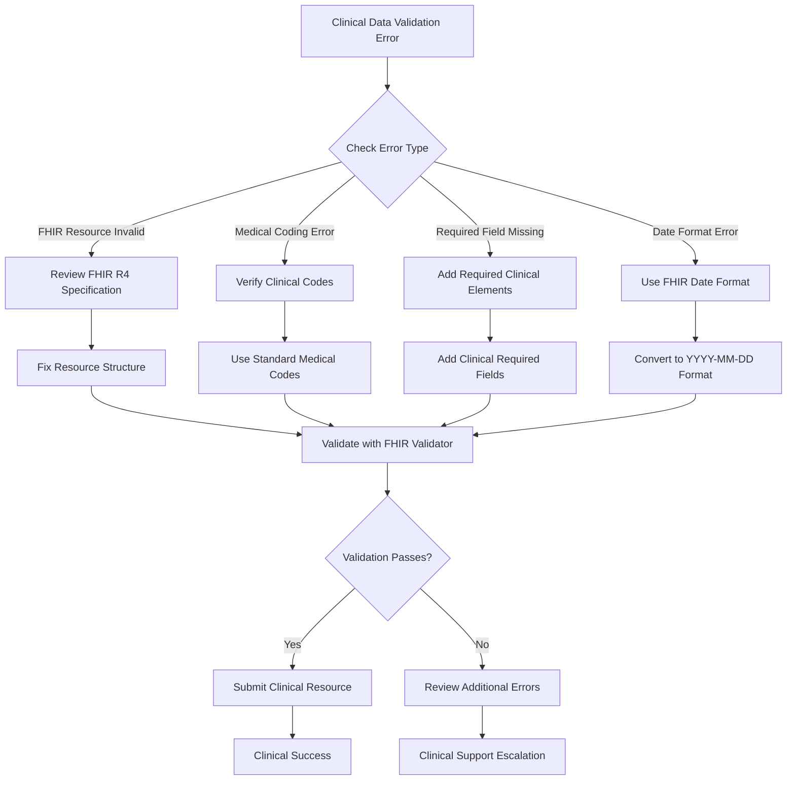

# Healthcare Help Content & Clinical Support Documentation

## Overview

This clinical help content section provides comprehensive troubleshooting guides, healthcare developer support resources, and medical platform support documentation to help you resolve clinical issues quickly and efficiently while maintaining HIPAA compliance and patient safety.

---

## Healthcare Support Categories

### Clinical Troubleshooting Guides
- **[FHIR Integration Issues](./troubleshooting/fhir-issues.md)** - Common FHIR R4 problems and clinical solutions
- **[Healthcare API Problems](./troubleshooting/clinical-api-issues.md)** - Development and medical integration troubleshooting
- **[SMART on FHIR Errors](./troubleshooting/smart-auth-errors.md)** - Healthcare authorization and clinical context issues
- **[Clinical Data Problems](./troubleshooting/clinical-data-issues.md)** - Patient data processing and medical coding issues

### Healthcare Developer Support
- **[Clinical Error Code Reference](./developer-support/clinical-error-codes.md)** - Comprehensive medical error code documentation
- **[Healthcare Debugging Tools](./developer-support/clinical-debugging.md)** - Clinical development and testing utilities
- **[Medical Performance Optimization](./developer-support/clinical-performance.md)** - Healthcare speed and efficiency improvements
- **[FHIR Migration Guides](./developer-support/fhir-migration.md)** - Upgrading clinical systems and FHIR versions

### Medical Platform Support
- **[Healthcare Account Management](./platform-support/clinical-account.md)** - Medical dashboard and clinical settings issues
- **[Clinical Billing & Pricing](./platform-support/healthcare-billing.md)** - Medical pricing questions and clinical billing support
- **[HIPAA Compliance & Security](./platform-support/hipaa-compliance.md)** - Regulatory and medical security guidance
- **[Clinical Service Status](./platform-support/clinical-status.md)** - Healthcare system health and medical maintenance

---

## Quick Clinical Problem Resolution

### Most Common Healthcare Issues

#### 1. FHIR Resource Validation Failed (Error Code: fhir_validation_error)
**Clinical Symptoms:**
- Patient or clinical resource creation fails
- Error message: "FHIR resource validation failed"
- Clinical transaction shows as rejected in healthcare dashboard

**Immediate Clinical Solutions:**
```javascript
// Check FHIR validation issues in API response
{
  "resourceType": "OperationOutcome",
  "issue": [
    {
      "severity": "error",
      "code": "invalid",
      "details": {
        "text": "Patient.birthDate: Invalid date format"
      },
      "location": ["Patient.birthDate"],
      "expression": ["Patient.birthDate"]
    }
  ]
}

// Common FHIR validation fixes:
const fhirValidationFixes = {
  'invalid_date_format': 'Use FHIR date format: YYYY-MM-DD',
  'missing_required_field': 'Add required FHIR elements (resourceType, id, etc.)',
  'invalid_coding_system': 'Use standard medical codes (SNOMED CT, LOINC, ICD-10)',
  'invalid_reference': 'Ensure referenced resources exist and are accessible',
  'invalid_identifier': 'Medical Record Number must have system and value'
};
```

**Clinical Resolution Steps:**
1. Check the specific FHIR validation error in your API response
2. Review FHIR R4 specification for the failing resource type
3. Validate medical coding systems (SNOMED CT, LOINC, ICD-10)
4. Ensure all required clinical fields are present and properly formatted

#### 2. SMART on FHIR Authentication Failed (Error Code: smart_auth_error)
**Clinical Symptoms:**
- Healthcare provider authentication fails
- Error message: "SMART on FHIR authorization failed"
- Cannot access patient data or clinical resources

**Immediate Clinical Solutions:**
```bash
# Verify SMART on FHIR configuration
curl -X GET https://fhir.medconnect.com/R4/metadata \
  -H "Accept: application/fhir+json"

# Check for SMART extension in CapabilityStatement
# Look for: http://fhir-registry.smarthealthit.org/StructureDefinition/oauth-uris

# Test clinical authorization endpoint
curl -X GET "https://auth.medconnect.com/authorize?client_id=your_client_id&response_type=code&scope=patient/*.read&redirect_uri=https://your-app.com/callback"
```

**Clinical Resolution Steps:**
1. Verify you're using correct SMART on FHIR endpoints
2. Check that clinical scopes match your healthcare application needs
3. Ensure redirect URI is registered in healthcare developer dashboard
4. Confirm clinical context (patient, encounter) if using EHR launch

#### 3. Patient Consent Required (Error Code: patient_consent_required)
**Clinical Symptoms:**
- Patient data access blocked
- Error message: "Patient consent required for data access"
- Clinical workflows stopped due to consent issues

**Immediate Clinical Solutions:**
```python
# Handle patient consent in clinical workflows
class PatientConsentManager:
    def __init__(self, fhir_client):
        self.fhir_client = fhir_client
    
    async def check_patient_consent(self, patient_id, data_type):
        """Check if patient has consented to data sharing"""
        try:
            # Look for Consent resources for this patient
            consent_search = await self.fhir_client.search({
                'resourceType': 'Consent',
                'patient': patient_id,
                'status': 'active',
                'category': self._get_consent_category(data_type)
            })
            
            if consent_search.total > 0:
                return {
                    'consent_granted': True,
                    'consent_id': consent_search.entry[0].resource.id,
                    'consent_date': consent_search.entry[0].resource.dateTime
                }
            else:
                return {
                    'consent_granted': False,
                    'consent_required': True,
                    'consent_url': f"https://patient-portal.medconnect.com/consent/{patient_id}"
                }
                
        except Exception as e:
            return {
                'consent_granted': False,
                'error': 'Unable to verify patient consent',
                'clinical_guidance': 'Contact patient to obtain explicit consent'
            }
    
    def _get_consent_category(self, data_type):
        """Map data types to consent categories"""
        consent_categories = {
            'clinical_data': 'http://terminology.hl7.org/CodeSystem/v3-ActCode#IDSCL',
            'research_data': 'http://terminology.hl7.org/CodeSystem/v3-ActCode#RSRCH',
            'quality_reporting': 'http://terminology.hl7.org/CodeSystem/v3-ActCode#QM'
        }
        return consent_categories.get(data_type, 'http://terminology.hl7.org/CodeSystem/v3-ActCode#IDSCL')
```

**Clinical Resolution Steps:**
1. Check if patient has provided consent for the specific data type
2. Direct patient to consent portal if consent is missing
3. Implement consent verification in clinical workflows
4. Document consent status in clinical audit logs

---

## Healthcare Diagnostic Tools

### Clinical Self-Service Diagnostics

#### FHIR Server Health Check Tool
```bash
#!/bin/bash
# MedConnect FHIR Server Diagnostic Script

echo "=== MedConnect FHIR Server Diagnostic ==="
echo "Date: $(date)"
echo "User: $USER"
echo

# Test FHIR server availability
echo "1. Testing FHIR server availability..."
curl -s -I https://fhir.medconnect.com/R4/metadata
echo

# Check FHIR CapabilityStatement
echo "2. Checking FHIR capabilities..."
curl -s https://fhir.medconnect.com/R4/metadata | jq '.software.name, .fhirVersion, .rest[0].mode'
echo

# Test SMART on FHIR configuration
echo "3. Testing SMART on FHIR configuration..."
curl -s https://fhir.medconnect.com/R4/metadata | jq '.rest[0].security.extension[] | select(.url | contains("oauth-uris"))'
echo

# Test clinical authentication
if [ ! -z "$MEDCONNECT_CLIENT_ID" ]; then
    echo "4. Testing clinical authentication..."
    echo "Client ID format: $(echo $MEDCONNECT_CLIENT_ID | head -c 15)..."
    
    # Test token endpoint
    curl -s -X POST https://auth.medconnect.com/oauth2/token \
         -H "Content-Type: application/x-www-form-urlencoded" \
         -d "grant_type=client_credentials&client_id=$MEDCONNECT_CLIENT_ID&client_secret=$MEDCONNECT_CLIENT_SECRET&scope=system/*.read" | jq '.error // "Authentication successful"'
else
    echo "4. MEDCONNECT_CLIENT_ID not set - skipping authentication test"
fi
echo

echo "=== Clinical Diagnostic Complete ==="
```

#### Clinical API Health Monitor
```python
import asyncio
import aiohttp
import json
from datetime import datetime, timedelta
import logging

class ClinicalAPIHealthMonitor:
    def __init__(self, fhir_base_url, client_credentials):
        self.fhir_base_url = fhir_base_url
        self.client_credentials = client_credentials
        self.clinical_logger = logging.getLogger('clinical_health_monitor')
    
    async def run_comprehensive_health_check(self):
        """Run comprehensive clinical API health check"""
        
        health_results = {
            "timestamp": datetime.utcnow().isoformat(),
            "overall_status": "unknown",
            "clinical_checks": {}
        }
        
        async with aiohttp.ClientSession() as session:
            # Test FHIR server connectivity
            health_results["clinical_checks"]["fhir_connectivity"] = await self._test_fhir_connectivity(session)
            
            # Test clinical authentication
            health_results["clinical_checks"]["clinical_auth"] = await self._test_clinical_authentication(session)
            
            # Test patient resource access
            health_results["clinical_checks"]["patient_access"] = await self._test_patient_resource_access(session)
            
            # Test clinical decision support
            health_results["clinical_checks"]["clinical_decision_support"] = await self._test_clinical_decision_support(session)
            
            # Test HIPAA compliance features
            health_results["clinical_checks"]["hipaa_compliance"] = await self._test_hipaa_compliance_features(session)
        
        # Determine overall clinical system health
        failed_checks = [k for k, v in health_results["clinical_checks"].items() if not v["success"]]
        health_results["overall_status"] = "healthy" if not failed_checks else "degraded"
        health_results["failed_clinical_checks"] = failed_checks
        
        return health_results
    
    async def _test_fhir_connectivity(self, session):
        """Test basic FHIR server connectivity"""
        try:
            async with session.get(f"{self.fhir_base_url}/metadata", timeout=10) as response:
                if response.status == 200:
                    capability_statement = await response.json()
                    return {
                        "success": True,
                        "fhir_version": capability_statement.get("fhirVersion"),
                        "software_name": capability_statement.get("software", {}).get("name"),
                        "response_time_ms": response.headers.get("X-Response-Time", "unknown")
                    }
                else:
                    return {
                        "success": False,
                        "status_code": response.status,
                        "clinical_guidance": "FHIR server not responding correctly"
                    }
        except asyncio.TimeoutError:
            return {
                "success": False,
                "error": "FHIR server timeout",
                "clinical_guidance": "Healthcare system may be experiencing high load"
            }
        except Exception as e:
            return {
                "success": False,
                "error": str(e),
                "clinical_guidance": "Check healthcare network connectivity"
            }
    
    async def _test_clinical_authentication(self, session):
        """Test SMART on FHIR authentication"""
        try:
            auth_data = {
                'grant_type': 'client_credentials',
                'client_id': self.client_credentials['client_id'],
                'client_secret': self.client_credentials['client_secret'],
                'scope': 'system/Patient.read system/Observation.read'
            }
            
            async with session.post(
                f"{self.fhir_base_url}/auth/token",
                data=auth_data,
                timeout=10
            ) as response:
                
                if response.status == 200:
                    token_data = await response.json()
                    return {
                        "success": True,
                        "token_type": token_data.get("token_type"),
                        "scope": token_data.get("scope"),
                        "expires_in": token_data.get("expires_in")
                    }
                else:
                    error_data = await response.json()
                    return {
                        "success": False,
                        "status_code": response.status,
                        "error": error_data.get("error"),
                        "clinical_guidance": "Verify clinical application credentials"
                    }
                    
        except Exception as e:
            return {
                "success": False,
                "error": str(e),
                "clinical_guidance": "Contact clinical technical support for authentication issues"
            }
    
    async def _test_patient_resource_access(self, session):
        """Test patient resource access with clinical context"""
        try:
            # First authenticate to get access token
            auth_result = await self._get_access_token(session)
            if not auth_result["success"]:
                return auth_result
            
            access_token = auth_result["access_token"]
            
            # Test patient search
            headers = {
                'Authorization': f'Bearer {access_token}',
                'Accept': 'application/fhir+json'
            }
            
            async with session.get(
                f"{self.fhir_base_url}/Patient?_count=1",
                headers=headers,
                timeout=10
            ) as response:
                
                if response.status == 200:
                    patient_bundle = await response.json()
                    return {
                        "success": True,
                        "patient_count": patient_bundle.get("total", 0),
                        "response_time_ms": response.headers.get("X-Response-Time", "unknown")
                    }
                else:
                    return {
                        "success": False,
                        "status_code": response.status,
                        "clinical_guidance": "Check clinical permissions and patient access rights"
                    }
                    
        except Exception as e:
            return {
                "success": False,
                "error": str(e),
                "clinical_guidance": "Verify clinical data access permissions"
            }
    
    async def _test_clinical_decision_support(self, session):
        """Test clinical decision support functionality"""
        try:
            # Test CDS Hooks endpoint
            async with session.get(f"{self.fhir_base_url}/cds-services", timeout=10) as response:
                if response.status == 200:
                    cds_services = await response.json()
                    return {
                        "success": True,
                        "available_services": len(cds_services.get("services", [])),
                        "service_names": [service.get("title") for service in cds_services.get("services", [])]
                    }
                else:
                    return {
                        "success": False,
                        "status_code": response.status,
                        "clinical_guidance": "Clinical decision support may not be available"
                    }
        except Exception as e:
            return {
                "success": False,
                "error": str(e),
                "clinical_guidance": "CDS services may be temporarily unavailable"
            }
    
    async def _test_hipaa_compliance_features(self, session):
        """Test HIPAA compliance features"""
        try:
            # Test audit log endpoint
            auth_result = await self._get_access_token(session)
            if not auth_result["success"]:
                return {"success": False, "error": "Cannot test HIPAA features without authentication"}
            
            headers = {
                'Authorization': f'Bearer {auth_result["access_token"]}',
                'Accept': 'application/fhir+json'
            }
            
            async with session.get(
                f"{self.fhir_base_url}/AuditEvent?_count=1",
                headers=headers,
                timeout=10
            ) as response:
                
                return {
                    "success": response.status in [200, 404],  # 404 is OK if no audit events yet
                    "audit_logging_available": response.status == 200,
                    "status_code": response.status,
                    "clinical_guidance": "HIPAA audit logging verified" if response.status == 200 else "Audit logging setup may be needed"
                }
                
        except Exception as e:
            return {
                "success": False,
                "error": str(e),
                "clinical_guidance": "HIPAA compliance features need verification"
            }
    
    async def _get_access_token(self, session):
        """Get access token for clinical API testing"""
        try:
            auth_data = {
                'grant_type': 'client_credentials',
                'client_id': self.client_credentials['client_id'],
                'client_secret': self.client_credentials['client_secret'],
                'scope': 'system/*.read'
            }
            
            async with session.post(f"{self.fhir_base_url}/auth/token", data=auth_data) as response:
                if response.status == 200:
                    token_data = await response.json()
                    return {
                        "success": True,
                        "access_token": token_data["access_token"]
                    }
                else:
                    return {
                        "success": False,
                        "error": "Authentication failed"
                    }
        except Exception as e:
            return {
                "success": False,
                "error": str(e)
            }

# Usage example
async def main():
    monitor = ClinicalAPIHealthMonitor(
        fhir_base_url="https://fhir.medconnect.com/R4",
        client_credentials={
            "client_id": "your_clinical_client_id",
            "client_secret": "your_clinical_client_secret"
        }
    )
    
    health_results = await monitor.run_comprehensive_health_check()
    
    print("=== Clinical API Health Check Results ===")
    print(json.dumps(health_results, indent=2))
    
    if health_results["overall_status"] == "healthy":
        print("✅ All clinical systems are healthy")
    else:
        print("⚠️  Some clinical systems need attention:")
        for failed_check in health_results["failed_clinical_checks"]:
            print(f"   - {failed_check}")

if __name__ == "__main__":
    asyncio.run(main())
```

---

## Clinical Error Resolution Workflows

### Healthcare Processing Errors

#### Workflow: Clinical Data Validation Resolution


#### Clinical Error Recovery Implementation
```java
// Comprehensive clinical error handling
public class ClinicalErrorHandler {
    private static final Logger CLINICAL_LOGGER = LoggerFactory.getLogger("CLINICAL_AUDIT");
    
    private final FHIRClient fhirClient;
    private final ClinicalAuditService auditService;
    private final PatientSafetyService safetyService;
    
    public ClinicalErrorHandler(FHIRClient fhirClient) {
        this.fhirClient = fhirClient;
        this.auditService = new ClinicalAuditService();
        this.safetyService = new PatientSafetyService();
    }
    
    public ClinicalResult processClinicalResourceWithRecovery(
            String resourceType, 
            Object clinicalResource, 
            String patientId
    ) {
        
        String operationId = UUID.randomUUID().toString();
        ClinicalContext context = new ClinicalContext(patientId, resourceType, operationId);
        
        try {
            // Log clinical operation start
            auditService.logClinicalOperation(
                context, 
                "CLINICAL_RESOURCE_PROCESSING_START", 
                Map.of("resource_type", resourceType)
            );
            
            // Pre-validation for patient safety
            PatientSafetyResult safetyCheck = safetyService.validatePatientSafety(
                clinicalResource, 
                patientId
            );
            
            if (!safetyCheck.isSafe()) {
                return ClinicalResult.safetyFailure(
                    safetyCheck.getSafetyIssues(),
                    "Clinical safety validation failed - operation blocked for patient protection"
                );
            }
            
            // Attempt clinical resource processing
            FHIRResource result = fhirClient.create(resourceType, clinicalResource);
            
            // Log successful clinical operation
            auditService.logClinicalOperation(
                context,
                "CLINICAL_RESOURCE_PROCESSING_SUCCESS",
                Map.of(
                    "resource_id", result.getId(),
                    "fhir_version", result.getMeta().getVersionId()
                )
            );
            
            return ClinicalResult.success(result);
            
        } catch (FHIRValidationException e) {
            return handleClinicalValidationError(e, context, clinicalResource);
            
        } catch (ClinicalAuthorizationException e) {
            return handleClinicalAuthorizationError(e, context);
            
        } catch (PatientConsentException e) {
            return handlePatientConsentError(e, context, patientId);
            
        } catch (ClinicalSystemException e) {
            return handleClinicalSystemError(e, context);
            
        } catch (Exception e) {
            return handleUnexpectedClinicalError(e, context);
        }
    }
    
    private ClinicalResult handleClinicalValidationError(
            FHIRValidationException e, 
            ClinicalContext context,
            Object clinicalResource
    ) {
        
        auditService.logClinicalError(
            context,
            "CLINICAL_VALIDATION_ERROR",
            Map.of(
                "validation_errors", e.getValidationIssues(),
                "error_count", e.getValidationIssues().size()
            )
        );
        
        // Attempt automatic clinical data correction
        ClinicalDataCorrector corrector = new ClinicalDataCorrector();
        Optional<Object> correctedResource = corrector.attemptAutoCorrection(
            clinicalResource, 
            e.getValidationIssues()
        );
        
        if (correctedResource.isPresent()) {
            CLINICAL_LOGGER.info("Attempting auto-correction for clinical validation errors");
            
            try {
                FHIRResource result = fhirClient.create(
                    context.getResourceType(), 
                    correctedResource.get()
                );
                
                auditService.logClinicalOperation(
                    context,
                    "CLINICAL_AUTO_CORRECTION_SUCCESS",
                    Map.of("corrected_issues", e.getValidationIssues().size())
                );
                
                return ClinicalResult.successWithWarnings(
                    result,
                    List.of("Clinical data was automatically corrected for FHIR compliance")
                );
                
            } catch (Exception autoCorrectError) {
                CLINICAL_LOGGER.warn("Clinical auto-correction failed", autoCorrectError);
            }
        }
        
        return ClinicalResult.validationFailure(
            e.getValidationIssues(),
            getClinicalValidationGuidance(e.getValidationIssues())
        );
    }
    
    private ClinicalResult handlePatientConsentError(
            PatientConsentException e,
            ClinicalContext context,
            String patientId
    ) {
        
        auditService.logClinicalError(
            context,
            "PATIENT_CONSENT_REQUIRED",
            Map.of(
                "patient_id_hash", hashPatientId(patientId),
                "consent_type", e.getRequiredConsentType(),
                "data_sensitivity", e.getDataSensitivityLevel()
            )
        );
        
        // Generate patient consent request
        ConsentRequest consentRequest = generateConsentRequest(
            patientId,
            e.getRequiredConsentType(),
            context.getResourceType()
        );
        
        return ClinicalResult.consentRequired(
            consentRequest,
            "Patient consent required before proceeding with clinical data operation"
        );
    }
    
    private ClinicalResult handleClinicalSystemError(
            ClinicalSystemException e,
            ClinicalContext context
    ) {
        
        auditService.logClinicalError(
            context,
            "CLINICAL_SYSTEM_ERROR",
            Map.of(
                "error_type", e.getErrorType(),
                "system_component", e.getFailedComponent(),
                "retry_recommended", e.isRetryRecommended()
            )
        );
        
        if (e.isRetryRecommended()) {
            return ClinicalResult.retryableFailure(
                e.getMessage(),
                "Clinical system temporarily unavailable - retry recommended",
                e.getRecommendedRetryDelay()
            );
        } else {
            return ClinicalResult.systemFailure(
                e.getMessage(),
                "Clinical system error requires manual intervention"
            );
        }
    }
    
    private String getClinicalValidationGuidance(List<ValidationIssue> issues) {
        StringBuilder guidance = new StringBuilder("Clinical validation guidance:\n");
        
        for (ValidationIssue issue : issues) {
            switch (issue.getCode()) {
                case "required":
                    guidance.append("- Add required clinical field: ").append(issue.getLocation()).append("\n");
                    break;
                case "code-invalid":
                    guidance.append("- Use standard medical codes (SNOMED CT, LOINC, ICD-10) for: ")
                           .append(issue.getLocation()).append("\n");
                    break;
                case "value":
                    guidance.append("- Clinical value out of acceptable range: ")
                           .append(issue.getLocation()).append("\n");
                    break;
                case "reference":
                    guidance.append("- Referenced clinical resource not found: ")
                           .append(issue.getLocation()).append("\n");
                    break;
                default:
                    guidance.append("- Review FHIR R4 specification for: ")
                           .append(issue.getLocation()).append("\n");
            }
        }
        
        guidance.append("\nFor clinical coding assistance, see: https://terminology.hl7.org/");
        return guidance.toString();
    }
    
    private String hashPatientId(String patientId) {
        // Create non-reversible hash for HIPAA-compliant logging
        return DigestUtils.sha256Hex(patientId + "_clinical_salt").substring(0, 16);
    }
}
```

---

## Clinical Escalation Procedures

### When to Contact Healthcare Support

#### Tier 1: Clinical Self-Service Resolution
**Handle Internally:** (Estimated Resolution: <2 hours)
- FHIR validation errors with clear error messages
- Standard clinical authentication issues (expired tokens, invalid scopes)
- Basic clinical integration questions covered in healthcare documentation
- Common patient consent and authorization scenarios

**Clinical Self-Service Tools:**
- Healthcare documentation search
- Clinical community forum
- FHIR error code reference
- Clinical diagnostic tools and health checks

#### Tier 2: Clinical Technical Support
**Contact Healthcare Support:** (Response Time: <2 hours)
- Complex FHIR interoperability issues
- Advanced clinical decision support problems
- EHR integration challenges
- HIPAA compliance questions
- Clinical performance and scalability concerns

**Required Clinical Information:**
- Healthcare account ID and environment (sandbox/production)
- Specific FHIR error messages and OperationOutcome resources
- Clinical workflow context and patient safety impact
- FHIR resource examples and request/response data
- Clinical use case and healthcare provider impact assessment

#### Tier 3: Critical Healthcare Issues
**Emergency Clinical Contact:** (Response Time: <30 minutes)
- Patient safety incidents related to clinical data
- Healthcare system outages affecting patient care
- HIPAA security breaches or suspected PHI exposure
- Clinical decision support system failures
- Critical clinical workflow disruptions

**Emergency Clinical Escalation Process:**
1. Call emergency healthcare support: +1-800-MEDCONNECT
2. Email: clinical-emergency@medconnect.com
3. Include "CLINICAL EMERGENCY" in subject line
4. Provide immediate patient safety and clinical impact assessment
5. Include any relevant patient identifiers (hashed for privacy)

### Clinical Support Request Template

```markdown
## Clinical Support Request Information

**Healthcare Account Details:**
- Account ID: [your-healthcare-account-id]
- Environment: [sandbox/production]
- FHIR Version: [R4]
- Clinical Application: [application-name-and-version]

**Clinical Issue Description:**
- Summary: [Brief description of the clinical issue]
- Patient Safety Impact: [Any impact on patient care or safety]
- Clinical Workflow Impact: [Effect on healthcare provider workflows]
- Frequency: [How often does this clinical issue occur?]
- Duration: [How long has this been affecting clinical operations?]

**Healthcare Technical Details:**
- FHIR Error Codes: [Specific FHIR error codes encountered]
- OperationOutcome: [FHIR OperationOutcome resources if available]
- Request ID: [If available from FHIR API response headers]
- Timestamp: [When did the clinical issue occur? Include timezone]
- Clinical Context: [Patient context, encounter context, provider context]

**FHIR Request/Response Examples:**
```json
// Example FHIR request
{
  "resourceType": "Patient",
  "identifier": [{"system": "...", "value": "..."}],
  "name": [{"family": "...", "given": ["..."]}]
}

// Example FHIR error response
{
  "resourceType": "OperationOutcome",
  "issue": [
    {
      "severity": "error",
      "code": "invalid",
      "details": {"text": "..."},
      "location": ["Patient.birthDate"]
    }
  ]
}
```

**Clinical Steps to Reproduce:**
1. [Clinical Step 1 - include patient/provider context]
2. [Clinical Step 2 - include FHIR resources involved]
3. [Clinical Step 3 - include expected clinical outcome]

**Expected Clinical Behavior:**
[What should have happened from a clinical workflow perspective?]

**Actual Clinical Behavior:**
[What actually happened and how it affects patient care?]

**Additional Clinical Context:**
- Healthcare Provider Type: [Primary care, specialist, hospital, etc.]
- Patient Population: [Adult, pediatric, geriatric, etc.]
- Clinical Specialty: [Cardiology, oncology, primary care, etc.]
- EHR System: [Epic, Cerner, AllScripts, etc.]
- Recent Clinical System Changes: [Any recent updates to clinical workflows]
- HIPAA Considerations: [Any privacy or security concerns]
```

---

## Clinical Performance Troubleshooting

### Healthcare API Response Time Issues

#### Clinical Performance Monitoring
```python
import asyncio
import time
from typing import Dict, List
from dataclasses import dataclass
from statistics import mean, median
import aiohttp

@dataclass
class ClinicalPerformanceMetric:
    operation_type: str
    resource_type: str
    response_time_ms: float
    success: bool
    patient_count: int
    timestamp: float
    clinical_context: str

class ClinicalPerformanceMonitor:
    def __init__(self, fhir_base_url: str, access_token: str):
        self.fhir_base_url = fhir_base_url
        self.access_token = access_token
        self.clinical_metrics: List[ClinicalPerformanceMetric] = []
        
    async def measure_clinical_operation(self, operation_type: str, operation_func, clinical_context: str = ""):
        """Measure clinical API operation performance"""
        start_time = time.time()
        
        try:
            result = await operation_func()
            success = True
            error = None
        except Exception as e:
            success = False
            error = str(e)
            result = None
        
        end_time = time.time()
        duration_ms = (end_time - start_time) * 1000
        
        # Extract clinical metadata
        resource_type = "unknown"
        patient_count = 0
        
        if result and isinstance(result, dict):
            resource_type = result.get("resourceType", "unknown")
            if resource_type == "Bundle":
                patient_count = result.get("total", 0)
            elif resource_type == "Patient":
                patient_count = 1
        
        metric = ClinicalPerformanceMetric(
            operation_type=operation_type,
            resource_type=resource_type,
            response_time_ms=duration_ms,
            success=success,
            patient_count=patient_count,
            timestamp=start_time,
            clinical_context=clinical_context
        )
        
        self.clinical_metrics.append(metric)
        
        return result, duration_ms, success, error
    
    def get_clinical_performance_summary(self, operation_type: str = None) -> Dict:
        """Get clinical performance statistics"""
        if operation_type:
            metrics = [m for m in self.clinical_metrics if m.operation_type == operation_type]
        else:
            metrics = self.clinical_metrics
        
        if not metrics:
            return None
        
        response_times = [m.response_time_ms for m in metrics]
        success_count = sum(1 for m in metrics if m.success)
        total_patients = sum(m.patient_count for m in metrics)
        
        return {
            'clinical_operation': operation_type or 'all_operations',
            'total_operations': len(metrics),
            'success_rate': success_count / len(metrics) if metrics else 0,
            'total_patients_processed': total_patients,
            'performance_metrics': {
                'avg_response_time_ms': mean(response_times),
                'median_response_time_ms': median(response_times),
                'p95_response_time_ms': self._percentile(response_times, 95),
                'p99_response_time_ms': self._percentile(response_times, 99),
                'max_response_time_ms': max(response_times),
                'min_response_time_ms': min(response_times)
            },
            'clinical_benchmarks': {
                'target_response_time_ms': 150,  # Healthcare target
                'acceptable_response_time_ms': 500,
                'critical_response_time_ms': 2000
            },
            'clinical_status': self._get_clinical_status(mean(response_times))
        }
    
    def _percentile(self, data: List[float], percentile: int) -> float:
        """Calculate percentile for clinical performance analysis"""
        sorted_data = sorted(data)
        index = int(len(sorted_data) * percentile / 100)
        return sorted_data[min(index, len(sorted_data) - 1)]
    
    def _get_clinical_status(self, avg_response_time: float) -> str:
        """Determine clinical system status based on performance"""
        if avg_response_time < 150:
            return "optimal_clinical_performance"
        elif avg_response_time < 500:
            return "acceptable_clinical_performance"
        elif avg_response_time < 2000:
            return "degraded_clinical_performance"
        else:
            return "critical_clinical_performance"
    
    async def run_clinical_load_test(self, concurrent_operations: int = 10, duration_seconds: int = 60):
        """Run clinical load test to assess system performance under healthcare workloads"""
        
        print(f"Starting clinical load test: {concurrent_operations} concurrent operations for {duration_seconds} seconds")
        
        start_time = time.time()
        end_time = start_time + duration_seconds
        
        async def clinical_operation_worker(worker_id: int):
            """Worker for simulating clinical operations"""
            async with aiohttp.ClientSession() as session:
                while time.time() < end_time:
                    try:
                        # Simulate patient search operation
                        await self.measure_clinical_operation(
                            f"patient_search_worker_{worker_id}",
                            lambda: self._simulate_patient_search(session),
                            f"load_test_worker_{worker_id}"
                        )
                        
                        # Small delay to simulate realistic clinical usage
                        await asyncio.sleep(0.1)
                        
                    except Exception as e:
                        print(f"Clinical worker {worker_id} error: {e}")
                        await asyncio.sleep(1)  # Back off on error
        
        # Start concurrent clinical workers
        workers = [clinical_operation_worker(i) for i in range(concurrent_operations)]
        await asyncio.gather(*workers, return_exceptions=True)
        
        # Analyze load test results
        load_test_summary = self.get_clinical_performance_summary("patient_search_worker")
        load_test_summary['load_test_config'] = {
            'concurrent_operations': concurrent_operations,
            'duration_seconds': duration_seconds,
            'total_operations_attempted': len([m for m in self.clinical_metrics if 'worker' in m.operation_type])
        }
        
        return load_test_summary
    
    async def _simulate_patient_search(self, session: aiohttp.ClientSession):
        """Simulate clinical patient search operation"""
        headers = {
            'Authorization': f'Bearer {self.access_token}',
            'Accept': 'application/fhir+json'
        }
        
        # Simulate various clinical search patterns
        search_patterns = [
            "Patient?family=Smith&_count=10",
            "Patient?given=John&_count=10", 
            "Patient?birthdate=ge1980-01-01&_count=10",
            "Patient?gender=female&_count=10",
            "Observation?category=vital-signs&_count=20",
            "MedicationRequest?status=active&_count=15"
        ]
        
        import random
        search_query = random.choice(search_patterns)
        
        async with session.get(f"{self.fhir_base_url}/{search_query}", headers=headers) as response:
            if response.status == 200:
                return await response.json()
            else:
                raise Exception(f"Clinical search failed with status {response.status}")

# Usage example for clinical performance monitoring
async def main():
    monitor = ClinicalPerformanceMonitor(
        fhir_base_url="https://fhir.medconnect.com/R4",
        access_token="your_clinical_access_token"
    )
    
    # Test individual clinical operations
    async with aiohttp.ClientSession() as session:
        # Monitor patient lookup performance
        result, duration, success, error = await monitor.measure_clinical_operation(
            "patient_lookup",
            lambda: session.get(f"{monitor.fhir_base_url}/Patient/test-patient-001").json(),
            "individual_patient_lookup"
        )
        
        print(f"Patient lookup took {duration:.2f}ms, success: {success}")
    
    # Run clinical load test
    load_test_results = await monitor.run_clinical_load_test(
        concurrent_operations=5,
        duration_seconds=30
    )
    
    print("\n=== Clinical Load Test Results ===")
    print(f"Clinical Status: {load_test_results['clinical_status']}")
    print(f"Average Response Time: {load_test_results['performance_metrics']['avg_response_time_ms']:.2f}ms")
    print(f"Success Rate: {load_test_results['success_rate']:.1%}")
    print(f"Total Patients Processed: {load_test_results['total_patients_processed']}")

if __name__ == "__main__":
    asyncio.run(main())
```

---

## Contact Information & Healthcare Resources

### Clinical Support Channels

#### Healthcare Technical Support
- **Email:** clinical-support@medconnect.com
- **Response Time:** Within 2 hours (24/7 for critical clinical issues)
- **Coverage:** Round-the-clock support for healthcare operations

#### Clinical Developer Support
- **Email:** clinical-developers@medconnect.com
- **Community Forum:** [community.medconnect.com/clinical](https://community.medconnect.com/clinical)
- **Clinical Office Hours:** Tuesdays and Thursdays 2-3 PM EST
- **GitHub:** [github.com/medconnect/clinical-support](https://github.com/medconnect/clinical-support)

#### Emergency Clinical Support
- **Phone:** +1-800-MEDCONNECT
- **Email:** clinical-emergency@medconnect.com
- **Available:** 24/7 for patient safety and critical clinical issues
- **Response Time:** Within 30 minutes for clinical emergencies

### Additional Healthcare Resources

#### Clinical Status & Monitoring
- **Healthcare Status Page:** [status.medconnect.com/clinical](https://status.medconnect.com/clinical)
- **FHIR API Monitoring:** Real-time clinical performance metrics
- **Clinical Incident History:** Past healthcare incidents and resolutions
- **Healthcare Maintenance Schedule:** Planned clinical system maintenance notifications

#### Clinical Learning Resources
- **Healthcare Documentation:** [clinical.medconnect.com](https://clinical.medconnect.com)
- **Clinical Video Tutorials:** [youtube.com/medconnect-clinical](https://youtube.com/medconnect-clinical)
- **Healthcare Webinars:** Monthly clinical technical deep-dives
- **Clinical Blog:** [blog.medconnect.com/clinical](https://blog.medconnect.com/clinical)

#### HIPAA & Compliance Resources
- **HIPAA Compliance Guide:** [compliance.medconnect.com/hipaa](https://compliance.medconnect.com/hipaa)
- **Clinical Security Best Practices:** [security.medconnect.com/clinical](https://security.medconnect.com/clinical)
- **Healthcare Audit Support:** [audit.medconnect.com](https://audit.medconnect.com)
- **Clinical Privacy Resources:** [privacy.medconnect.com/clinical](https://privacy.medconnect.com/clinical)

---

*This clinical help content is regularly updated based on common healthcare support requests and clinical user feedback. If you can't find the clinical information you need, don't hesitate to contact our healthcare support team. Patient safety and clinical workflow continuity are our top priorities.*